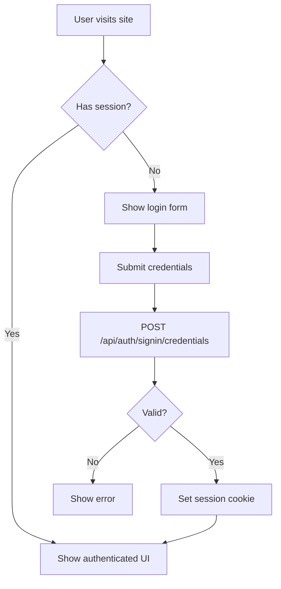

# 🔐 Frontend Authentication Guide - CertiChain

Hướng dẫn sử dụng NextAuth v4 authentication trong CertiChain cho Frontend Engineers.

---

## 📋 Table of Contents

1. [Setup & Configuration](#setup--configuration)
2. [Authentication Flow](#authentication-flow)
3. [Client-Side Usage](#client-side-usage)
4. [Server-Side Usage](#server-side-usage)
5. [Protected Routes](#protected-routes)
6. [API Calls with Auth](#api-calls-with-auth)
7. [Common Patterns](#common-patterns)
8. [Troubleshooting](#troubleshooting)

---

## Setup & Configuration

### Environment Variables

Đảm bảo `.env` có các biến sau:

```env
NEXTAUTH_URL=http://localhost:3000
NEXTAUTH_SECRET=/UzmHcSefmOLGniBRvGXcmVKj9o4DgaZPmF3QBUnNPI=
DATABASE_URL=postgresql://...
```

### User Credentials (Development)

| Username | Password | Role | User ID |
|----------|----------|------|---------|
| httt22001 | sinooStu | STUDENT | 4 |
| httt22002 | sinooStu | STUDENT | 1 |
| httt22003 | sinooStu | STUDENT | 2 |
| admin | sinooAd | ADMIN | 3 |

---

## Authentication Flow



---

## Client-Side Usage

### 1. Get Session in Client Component

```tsx
"use client";

import { useSession } from "next-auth/react";

export default function ProfilePage() {
  const { data: session, status } = useSession();

  if (status === "loading") {
    return <div>Loading...</div>;
  }

  if (status === "unauthenticated") {
    return <div>Please log in</div>;
  }

  return (
    <div>
      <h1>Welcome, {session?.user?.username}!</h1>
      <p>Role: {session?.user?.role}</p>
      <p>User ID: {session?.user?.id}</p>
    </div>
  );
}
```

### 2. Login Component

```tsx
"use client";

import { signIn } from "next-auth/react";
import { useState } from "react";
import { useRouter } from "next/navigation";

export default function LoginForm() {
  const [username, setUsername] = useState("");
  const [password, setPassword] = useState("");
  const [error, setError] = useState("");
  const [loading, setLoading] = useState(false);
  const router = useRouter();

  const handleSubmit = async (e: React.FormEvent) => {
    e.preventDefault();
    setLoading(true);
    setError("");

    try {
      const result = await signIn("credentials", {
        username,
        password,
        redirect: false, // Don't auto-redirect
      });

      if (result?.error) {
        setError("Invalid credentials");
      } else if (result?.ok) {
        // Login successful
        router.push("/dashboard");
        router.refresh(); // Refresh server components
      }
    } catch (err) {
      setError("An error occurred");
    } finally {
      setLoading(false);
    }
  };

  return (
    <form onSubmit={handleSubmit}>
      <div>
        <label htmlFor="username">Username</label>
        <input
          id="username"
          type="text"
          value={username}
          onChange={(e) => setUsername(e.target.value)}
          required
          minLength={3}
        />
      </div>

      <div>
        <label htmlFor="password">Password</label>
        <input
          id="password"
          type="password"
          value={password}
          onChange={(e) => setPassword(e.target.value)}
          required
          minLength={6}
        />
      </div>

      {error && <p className="error">{error}</p>}

      <button type="submit" disabled={loading}>
        {loading ? "Logging in..." : "Login"}
      </button>
    </form>
  );
}
```

### 3. Logout Component

```tsx
"use client";

import { signOut } from "next-auth/react";
import { useRouter } from "next/navigation";

export default function LogoutButton() {
  const router = useRouter();

  const handleLogout = async () => {
    await signOut({
      redirect: false, // Don't auto-redirect
    });
    router.push("/");
    router.refresh();
  };

  return (
    <button onClick={handleLogout}>
      Logout
    </button>
  );
}
```

### 4. Conditional Rendering Based on Auth

```tsx
"use client";

import { useSession } from "next-auth/react";
import Link from "next/link";

export default function Navigation() {
  const { data: session, status } = useSession();

  return (
    <nav>
      {status === "authenticated" ? (
        <>
          <span>Hello, {session.user.username}</span>
          <Link href="/dashboard">Dashboard</Link>
          <LogoutButton />
        </>
      ) : (
        <>
          <Link href="/login">Login</Link>
          <Link href="/register">Register</Link>
        </>
      )}
    </nav>
  );
}
```

---

## Server-Side Usage

### 1. Get Session in Server Component

```tsx
import { auth } from "@/lib/auth";
import { redirect } from "next/navigation";

export default async function DashboardPage() {
  const session = await auth();

  if (!session) {
    redirect("/login");
  }

  return (
    <div>
      <h1>Dashboard</h1>
      <p>Welcome, {session.user.username}!</p>
      <p>Role: {session.user.role}</p>
    </div>
  );
}
```

### 2. Get Session in API Route

```typescript
import { auth } from "@/lib/auth";
import { NextResponse } from "next/server";

export async function GET(request: Request) {
  const session = await auth();

  if (!session) {
    return NextResponse.json(
      { error: "Unauthorized" },
      { status: 401 }
    );
  }

  // Use session.user.id, session.user.role, etc.
  return NextResponse.json({
    userId: session.user.id,
    username: session.user.username,
    role: session.user.role,
  });
}
```

### 3. Role-Based Access Control

```typescript
import { auth } from "@/lib/auth";
import { NextResponse } from "next/server";

export async function POST(request: Request) {
  const session = await auth();

  if (!session) {
    return NextResponse.json(
      { error: "Unauthorized" },
      { status: 401 }
    );
  }

  // Check if user is ADMIN
  if (session.user.role !== "ADMIN") {
    return NextResponse.json(
      { error: "Forbidden - Admin only" },
      { status: 403 }
    );
  }

  // Admin-only logic here
  return NextResponse.json({ success: true });
}
```

---

## Protected Routes

### Using Middleware (Recommended)

Create `middleware.ts` in root directory:

```typescript
import { NextResponse } from "next/server";
import type { NextRequest } from "next/server";
import { getToken } from "next-auth/jwt";

export async function middleware(request: NextRequest) {
  const token = await getToken({
    req: request,
    secret: process.env.NEXTAUTH_SECRET,
  });

  const isAuthPage = request.nextUrl.pathname.startsWith("/login") ||
                     request.nextUrl.pathname.startsWith("/register");
  const isProtectedPage = request.nextUrl.pathname.startsWith("/dashboard") ||
                          request.nextUrl.pathname.startsWith("/certificates/create");

  // Redirect to login if accessing protected page without auth
  if (isProtectedPage && !token) {
    return NextResponse.redirect(new URL("/login", request.url));
  }

  // Redirect to dashboard if accessing auth page while authenticated
  if (isAuthPage && token) {
    return NextResponse.redirect(new URL("/dashboard", request.url));
  }

  return NextResponse.next();
}

export const config = {
  matcher: ["/dashboard/:path*", "/certificates/create/:path*", "/login", "/register"],
};
```

---

## API Calls with Auth

### Using fetch with Session

```typescript
"use client";

import { useSession } from "next-auth/react";

export default function CreateCertificate() {
  const { data: session } = useSession();

  const createCertificate = async (formData: FormData) => {
    // Session cookie is automatically sent with fetch
    const response = await fetch("/api/certificates", {
      method: "POST",
      body: formData,
      // No need to manually add auth headers
      // NextAuth handles this via cookies
    });

    if (response.status === 401) {
      // Unauthorized - redirect to login
      window.location.href = "/login";
      return;
    }

    const data = await response.json();
    return data;
  };

  return (
    <form onSubmit={(e) => {
      e.preventDefault();
      const formData = new FormData(e.currentTarget);
      createCertificate(formData);
    }}>
      {/* Form fields */}
    </form>
  );
}
```

---

## Common Patterns

### 1. Check if User is Logged In

```tsx
"use client";

import { useSession } from "next-auth/react";

export function useAuth() {
  const { data: session, status } = useSession();

  return {
    user: session?.user,
    isAuthenticated: status === "authenticated",
    isLoading: status === "loading",
    isAdmin: session?.user?.role === "ADMIN",
    isStudent: session?.user?.role === "STUDENT",
  };
}

// Usage
function MyComponent() {
  const { user, isAuthenticated, isAdmin } = useAuth();

  if (!isAuthenticated) {
    return <LoginPrompt />;
  }

  return <div>Welcome {user.username}</div>;
}
```

### 2. Require Authentication HOC

```tsx
"use client";

import { useSession } from "next-auth/react";
import { useRouter } from "next/navigation";
import { useEffect } from "react";

export function withAuth<P extends object>(
  Component: React.ComponentType<P>
) {
  return function AuthenticatedComponent(props: P) {
    const { data: session, status } = useSession();
    const router = useRouter();

    useEffect(() => {
      if (status === "unauthenticated") {
        router.push("/login");
      }
    }, [status, router]);

    if (status === "loading") {
      return <div>Loading...</div>;
    }

    if (!session) {
      return null;
    }

    return <Component {...props} />;
  };
}

// Usage
const ProtectedPage = withAuth(function MyPage() {
  return <div>Protected content</div>;
});
```

### 3. Session Refresh

```tsx
"use client";

import { useSession } from "next-auth/react";

export default function MyComponent() {
  const { data: session, update } = useSession();

  const refreshSession = async () => {
    // Force session refresh from server
    await update();
  };

  return (
    <button onClick={refreshSession}>
      Refresh Session
    </button>
  );
}
```

---

## Troubleshooting

### Session is null/undefined

**Problem:** `useSession()` returns `null` or `undefined`

**Solutions:**

1. Đảm bảo component được wrap trong `<SessionProvider>`
2. Check `.env` có `NEXTAUTH_URL` và `NEXTAUTH_SECRET`
3. Clear cookies và login lại
4. Check server logs for errors

```bash
# Clear browser cookies
# Chrome: DevTools > Application > Cookies > Delete all
```

### 401 Unauthorized on API calls

**Problem:** API routes trả về 401 dù đã login

**Solutions:**

1. Đảm bảo cookies được gửi kèm request
2. Check `credentials: 'include'` nếu dùng external API
3. Verify session trong API route:

```typescript
const session = await auth();
console.log("Session:", session); // Debug
```

### Redirect loop after login

**Problem:** Sau khi login bị redirect liên tục

**Solutions:**

1. Check middleware config
2. Đảm bảo `redirect: false` trong `signIn()`
3. Manual navigation sau login:

```typescript
const result = await signIn("credentials", {
  username,
  password,
  redirect: false, // Important!
});

if (result?.ok) {
  router.push("/dashboard");
}
```

### Session not persisting

**Problem:** Session mất sau khi refresh page

**Solutions:**

1. Check cookie settings trong browser (allow cookies)
2. Verify `NEXTAUTH_URL` matches your domain
3. Check browser console for cookie errors
4. Ensure `strategy: "jwt"` in auth config

---

## TypeScript Types

### Session Type

```typescript
import { Session } from "next-auth";

// Session structure
interface Session {
  user: {
    id: string;
    username: string;
    role: "ADMIN" | "STUDENT";
  };
  expires: string;
}
```

### Custom Hook Type

```typescript
import { useSession } from "next-auth/react";

type AuthStatus = "authenticated" | "unauthenticated" | "loading";

interface UseAuthReturn {
  user: Session["user"] | null;
  isAuthenticated: boolean;
  isLoading: boolean;
  status: AuthStatus;
}
```

---

## Testing Authentication

### Manual Browser Test

1. Start server: `npm run dev`
2. Open: `http://localhost:3000`
3. Login with: `httt22002` / `sinooStu`
4. Check DevTools > Application > Cookies for `next-auth.session-token`
5. Navigate to protected routes
6. Test logout

### Script Test

```bash
npx tsx test-auth.ts
```

### Database Test

```bash
npx tsx test-auth-simple.ts
```

---

## Best Practices

### ✅ DO

- Always use `redirect: false` trong `signIn()` để control navigation
- Check session status trước khi render protected content
- Handle loading states (show skeleton/spinner)
- Implement proper error handling
- Use `useSession()` trong Client Components
- Use `auth()` trong Server Components/API Routes
- Clear error messages on retry
- Validate forms before submission

### ❌ DON'T

- Don't store sensitive data in session (only id, username, role)
- Don't use `SessionProvider` trong Server Components
- Don't expose password hashes to frontend
- Don't skip redirect handling after login/logout
- Don't forget to handle session expiry
- Don't mix Client and Server auth methods

---

## Additional Resources

- [NextAuth.js v4 Documentation](https://next-auth.js.org/)
- [Next.js App Router Authentication](https://nextjs.org/docs/app/building-your-application/authentication)
- [NextAuth JWT Strategy](https://next-auth.js.org/configuration/options#session)

---

## Quick Reference

### Import Statements

```typescript
// Client Components
import { useSession, signIn, signOut } from "next-auth/react";

// Server Components & API Routes
import { auth } from "@/lib/auth";

// Middleware
import { getToken } from "next-auth/jwt";
```

### Common Patterns

```typescript
// Check auth in Client Component
const { data: session, status } = useSession();

// Check auth in Server Component
const session = await auth();

// Login
await signIn("credentials", { username, password, redirect: false });

// Logout
await signOut({ redirect: false });

// Role check
session?.user?.role === "ADMIN"
```

---

**Document Version:** 1.0  
**Last Updated:** October 30, 2025  
**Author:** CertiChain Team
